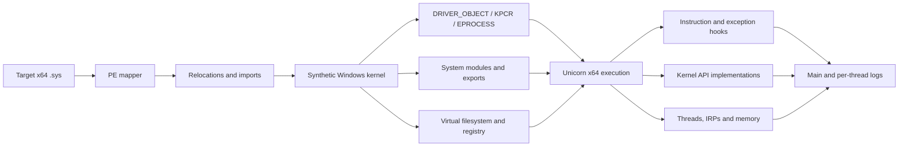

<div align="center">

# 🛡️ KEVLAR

### Kernel Export Virtualization Layer And Runtime

**An x64 Windows kernel-driver emulation and behavior-analysis harness powered by Unicorn.**

[](#requirements)
[](#build)
[](https://www.unicorn-engine.org/)
[](#build)

[Overview](#overview) • [Architecture](#architecture) • [Build](#build) • [Usage](#usage) • [Compatibility](#compatibility) • [Roadmap](#roadmap)

</div>

---

## Overview

KEVLAR maps a 64-bit Windows kernel driver into a synthetic kernel address space, resolves its imports into host implementations or controlled stubs, builds the minimum kernel environment it needs, and executes `DriverEntry` inside Unicorn—without loading the target driver into the live Windows kernel.

It is designed for driver behavior research, execution tracing, environment-probe analysis, and iterative reconstruction of missing kernel semantics.

> [!IMPORTANT]
> KEVLAR is a specialized research harness, not a complete Windows virtual machine. A driver reaching the end of `DriverEntry` does not prove that its returned `NTSTATUS` indicates successful initialization.

## Architecture



## Capabilities

| Area | Implemented behavior |
|---|---|
| **Image loading** | x64 PE mapping, relocations, import resolution and synthetic kernel addresses |
| **Kernel environment** | `DRIVER_OBJECT`, `DRIVER_EXTENSION`, KPCR/KPRCB, ETHREAD, EPROCESS and loader entries |
| **System state** | `PsLoadedModuleList`, real or stubbed modules, exports and `KUSER_SHARED_DATA` |
| **Execution** | Unicorn x64 emulation with custom unsupported-instruction handling |
| **CPU hooks** | CPUID, RDTSC, RDMSR, WRMSR, syscall, interrupts and port I/O |
| **Instructions** | Additional AVX, AES, SHA and CRC instruction emulation |
| **Memory** | Pool, variable, user-mode and mapped-image memory management |
| **I/O** | Create, close, cleanup, read, write and IOCTL dispatch paths |
| **State isolation** | Per-driver virtual filesystem and registry trees |
| **Diagnostics** | Module reads, PE probes, exceptions, firmware, CPUID, timing and unmapped-memory tracing |
| **Concurrency** | Synthetic system threads with independent Unicorn engines and stacks |

## Requirements

- Windows x64
- Visual Studio 2022 Build Tools or Visual Studio 2022
- **Desktop development with C++** workload
- Windows 10/11 SDK
- PowerShell 5.1 or newer

Dependencies are pinned through `vcpkg.json`:

- [Unicorn 2.1.4](https://github.com/unicorn-engine/unicorn)
- [Zydis 4.1.1](https://github.com/zyantific/zydis)
- [Zycore 1.5.2](https://github.com/zyantific/zycore-c)

## Build

The build script locates Visual Studio, restores the static x64 dependencies, and builds the solution:

```powershell
Set-ExecutionPolicy -Scope Process Bypass
.\build.ps1 Release
```

Build Debug when diagnostics and symbols are required:

```powershell
.\build.ps1 Debug
```

Outputs are separated to prevent Debug and Release configurations from overwriting each other:

```text
builds\Release\KEVLAR.exe
builds\Debug\KEVLAR.exe
```

### Why is there a Unicorn overlay port?

The upstream Unicorn 2.1.4 static CMake build creates a symbolic link during packaging. On Windows that operation requires Developer Mode or elevated symlink privileges. `vcpkg-ports/unicorn/no-symlink.patch` replaces it with an ordinary file copy; no emulator behavior is changed.

## Usage

```powershell
.\builds\Release\KEVLAR.exe C:\path\to\driver.sys
```

Enable focused diagnostics:

```powershell
.\builds\Release\KEVLAR.exe C:\path\to\driver.sys --diag --modreads
```

### Options

| Option | Purpose |
|---|---|
| `--diag` | Enable detailed diagnostic hooks; significantly slower |
| `--modreads` | Trace reads from mapped system modules |
| `--no-seh` | Disable synthetic SEH dispatch |
| `--intel` | Accepted for compatibility; the coherent Intel profile is always active |
| `--seed <n>` | Deterministic seed for TSC jitter (default is fixed) |
| `--vgk-override` | Convert the configured VGK access-denied result to success |
| `--devirt` | Enable devirtualization-testing behavior |
| `--strict-exports` | Unhandled exports return `STATUS_NOT_IMPLEMENTED` instead of `0` |
| `--provenance` | Trace branch decisions + API results for early rejection paths |
| `--trace <file>` | Record a deterministic execution trace |
| `--check <file>` | Replay a trace; report the first divergence |
| `--no-pause` | Skip the final pause; exit ~5s after a no-thread run (automation) |

### Runtime layout

On first launch, KEVLAR downloads NTDLL and NTOSKRNL symbols into `pdb_cache`. Real system modules can be placed beside the executable when a target requires their actual image; otherwise KEVLAR creates bounded module stubs.

```text
builds/Release/
├── KEVLAR.exe
├── pdb_cache/
├── kevlar.log
├── easyanticheat_threads/
└── <driver>/
    ├── vfs/
    └── vreg/
```

## Compatibility

Compatibility is path- and version-specific. Results beyond `DriverEntry` depend on the APIs and kernel behavior exercised by each driver.

| Target family | Current state |
|---|---|
| EAC | Primary target of the original implementation |
| BattlEye | Reported working on tested initialization paths |
| Vanguard | Reported to progress through tested boot-time checks |
| FACEIT | Images map and execute; current drivers reject the synthetic environment early |
| General drivers | Requires implementations for the exact paths exercised |

### Current FACEIT baseline

Before compatibility work, the locally tested FACEIT drivers both reached their entry points and returned the same vendor-specific failure:

| Driver | SHA-256 | Result |
|---|---|---|
| `FACEIT_AC.sys` | `8b26feff7fc5f75b5eaad42e99b4d9c5b6cd779c408e5d882b5549e6de15b6d9` | `DriverEntry → 0xC0EB0001` |
| `FACEIT_IOMMU.sys` | `86f93b3b6d899ec7cd3250866fe22251b875a4de2965da642e0a4f2e2ac91f39` | `DriverEntry → 0xC0EB0001` |

Both failures occur after early platform checks involving `InitSafeBootMode`, `KUSER_SHARED_DATA`, CPU feature data and the hypervisor CPUID range. No FACEIT compatibility changes are included in this baseline commit.

## Project layout

```text
KEVLAR/
├── api/                    # Emulated kernel API implementations
├── core/
│   ├── debug/              # Logging, rendering and bugcheck diagnostics
│   ├── diagnostics/        # Structured execution observations
│   ├── exception/          # SEH and unwind support
│   ├── exec/               # Unicorn engine, hooks and instruction emulation
│   ├── io/                 # IRP and I/O manager behavior
│   ├── loader/             # Modules and synthetic kernel structures
│   ├── memory/             # Guest/host memory mapping
│   ├── process/            # Synthetic threading
│   └── registry/           # Virtual filesystem and registry
├── host/                   # CLI, providers and host configuration
└── include/                # Windows definitions and structure layouts

libs/                      # Logger, PE mapper and symbol parser
extern/                    # Vendored public headers
vcpkg-ports/               # Reproducible dependency overlay
tests/                     # Smoke test driver generator + runner
tools/pdb_layout/          # DIA-based kernel structure layout generator
generated/                 # Generated layout headers (pdb_layout output)
```

## Roadmap

- [x] Replace independent CPUID mutations with coherent platform profiles
- [x] Add branch and value-provenance tracing for early rejection paths (`--provenance`)
- [x] Generate Windows-build-specific kernel structure layouts from PDBs (`tools/pdb_layout`)
- [x] Add strict handling for unknown exports instead of ambiguous zero returns (`--strict-exports`)
- [ ] Expand scheduler, IRQL, APC, DPC, timer and synchronization semantics
- [ ] Model ACPI, PCI and IOMMU state for IOMMU-oriented drivers
- [x] Add deterministic trace replay and differential validation (`--trace` / `--check`)
- [x] Add automated smoke tests for PE mapping and emulator initialization (`tests/smoke.ps1`)

The two remaining items are deferred deliberately: a full scheduler/IRQL/APC/DPC model is
weeks of semantics work that a partial implementation would destabilize, and ACPI/PCI/IOMMU
modeling needs a captured trace of what an IOMMU-oriented driver (e.g. FACEIT_IOMMU) actually
reads before it can be shaped.

### Smoke tests and layout generation

Automated smoke tests cover PE mapping and emulator initialization end-to-end:

```powershell
.\tests\smoke.ps1                 # builds, generates a minimal .sys, runs, asserts
.\tests\smoke.ps1 -SkipBuild      # reuse an existing build
```

`tests\make_test_driver.py` emits a minimal x64 native driver (no imports, a KPCR/GS read,
a conditional branch) that must return `STATUS_SUCCESS` for the test to pass.

Structure layouts for the actual target ntoskrnl PDB are generated with the DIA SDK:

```powershell
.\tools\pdb_layout.ps1            # -> generated\kernel_layout.h (GEN_<STRUCT>_<FIELD> defines)
```

The harness still uses the hardcoded `ntoskrnl_struct.h` layouts; regenerating and consuming
the generated offsets for a different Windows build is a follow-on.

## Known limitations

- The included kernel structure definitions are based primarily on Windows 10 21H2 x64.
- Many kernel exports are simplified or intentionally stubbed.
- Unknown return values can alter downstream control flow.
- Host threads do not perfectly reproduce Windows scheduling and IRQL behavior.
- PnP, power, DMA, filter stacks and real device behavior are incomplete.
- Diagnostic mode can produce large traces and run substantially slower.
- Import resolution (`PEFile::ResolveImport`) crashes the host when a driver imports from
  a resolvable `ntoskrnl.exe`: `ParseExport` can record a dangling export-name key in the
  per-module export map, and `GetExport` on the affected hash bucket faults. The cached
  `ntoskrnl.exe` is also not always resolvable by the loader, which takes the null-import
  path. This is pre-existing and surfaced by the smoke-test driver; it must be fixed before
  any real driver import (EAC/VGK/FACEIT all import ntoskrnl functions).

## Credits

- **lolz5465az** — original KEVLAR author and public release
- **TheRealWaryas** — KACE, which inspired the project’s early development
- **Unicorn Engine** — CPU emulation
- **Zydis / Zycore** — x86/x64 instruction decoding and support

Original release discussion: [UnknownCheats — KEVLAR x64 kernel driver emulator source](https://www.unknowncheats.me/forum/anti-cheat-bypass/765226-kevlar-x64-kernel-driver-emulator-source-eac-vgk.html)

## License

The source archive did not include a license file. Publication of this repository does not add or imply a new license; original authors retain their applicable rights.
